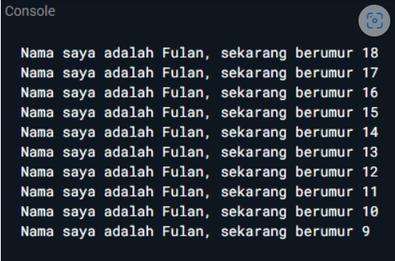

# Soal 1

Modifikasilah kode pada baris 3 di VS Code atau Editor Code favorit Anda berikut ini agar mendapatkan keluaran (output) sesuai yang diminta!

Output yang diminta:

## Jawaban:

# Soal 2

Mengapa sangat penting untuk memahami bahasa pemrograman Dart sebelum kita menggunakan framework Flutter ? Jelaskan!

## Jawaban:

Sangat penting untuk memahami bahasa pemrograman Dart sebelum menggunakan framework Flutter karena beberapa alasan:

1. Dasar Pemrograman: Dart adalah bahasa pemrograman yang digunakan untuk membuat aplikasi Flutter. Memahami dasar-dasar pemrograman Dart seperti variabel, kontrol struktur, fungsi, dan objek akan membantu memahami bagaimana Flutter bekerja.
2. Konsep Pemrograman Berorientasi Objek: Dart adalah bahasa pemrograman berorientasi objek, yang berarti bahwa perlu memahami konsep-konsep seperti kelas, objek, inheritance, dan polymorphism. Memahami konsep-konsep ini akan membantu membuat kode yang lebih efektif dan efisien.
3. Penggunaan Widget: Flutter menggunakan widget sebagai komponen dasar untuk membuat antarmuka pengguna. Memahami bagaimana menggunakan widget dan mengatur layout akan membantu membuat aplikasi yang lebih menarik dan interaktif.
4. Penggunaan Library dan Package: Dart memiliki banyak library dan package yang dapat digunakan untuk memperluas fungsionalitas aplikasi. Memahami bagaimana menggunakan library dan package akan membantu membuat aplikasi yang lebih kompleks dan canggih.
5. Penggunaan Asynchronous Programming: Dart memiliki fitur asynchronous programming yang memungkinkan membuat kode yang lebih efisien dan tidak memblokir. Memahami bagaimana menggunakan asynchronous programming akan membantu membuat aplikasi yang lebih responsif dan cepat.

# Soal 3

Rangkumlah materi dari codelab ini menjadi poin-poin penting yang dapat gunakan untuk membantu proses pengembangan aplikasi mobile menggunakan framework Flutter.

## Jawaban:

* Dart bertujuan unntuk menggabungkan kelebihan dari sebagaian besar bahasa tigkat tinggi dengan fitur bahasa pemrgraman terkini antara lain: Produktive tooling, Garbage collection, Type annotations, Statically typed, Portabilty

* Flutter adalah framework yang menggunakan bahasa pemrograman Dart untuk membuat aplikasi mobile

* Dart diluncurkan pada tahun 2011, dan rilis versi stabilnya pada tahun 2013 (awalnya dberfokus pada pengembangan web untuk menggantikan JS dan sekarang fokus pada mobile development)

* Dart adalah bahasa modern yang luar biasa, mendukung lintas platform, dan memiliki tujuan umum dengan terus meningkatkan fitur-fiturnya, membuatnya lebih kekinian dan fleksibel. Itulah sebabnya tim Flutter framework memilih bahasa Dart untuk digunakan.

* Dart VM and JavaScript compilation
Kode Dart dapat dieksekusi pada lingkungan yang mendukung bahasa Dart. Lingkungan yang mendukung bahasa Dart perlu memperhatikan fitur-fitur penting seperti berikut:
- Runtime systems
- Dart core libraries
- Garbage collectors
* Eksekusi kode Dart dapat beroperasi dalam dua mode — kompilasi Just-In-Time (JIT) atau Kompilasi Ahead-Of-Time (AOT). Dijelaskan secara lebih rinci sebagai berikut:

* Kompilasi JIT adalah tempat kode sumber dikompilasi sesuai kebutuhan—Just in time. 
* Kompilasi AOT adalah dimana Dart VM dan kode Anda dikompilasi sebelumnya, VM bekerja lebih seperti sistem runtime Dart, yang menyediakan garbage collector dan metode-metode native dari Dart software development kit (SDK) pada aplikasi.

* Dart dirancang untuk object-oriented (OO). Secara singkat, Bahasa OOP didasarkan pada konsep objek yang menyimpan kedua data (disebut fields) dan kode (disebut methods).

* Dart hadir dengan banyak operator typical yang bekerja seperti banyak bahasa pemrograman lainnya
* Operator Dart increment dan decrement berperilaku mirip dengan bahasa lain. 
* Di Dart, tidak seperti Java dan bahasa lainnya, operator == tidak membandingkan referensi/alamat memori melainkan isi dari variabel tersebut. Juga, tidak seperti JavaScript, tidak ada operator === yang diperlukan pada Dart karena telah memiliki fitur type safety yang memastikan bahwa operator persamaan == hanya digunakan pada objek dengan tipe yang sama.
* Operator logika di Dart adalah operator yang diterapkan pada operan bool; bisa berupa variabel, ekspresi, atau kondisi.
* Seperti kebanyakan bahasa modern, Dart menggunakan function dan method sebagai cara untuk memisahkan kode. Sebuah function atau method adalah potongan kode yang menerima beberapa data, eksekusi kode, dan kemudian mengembalikan beberapa data (return).